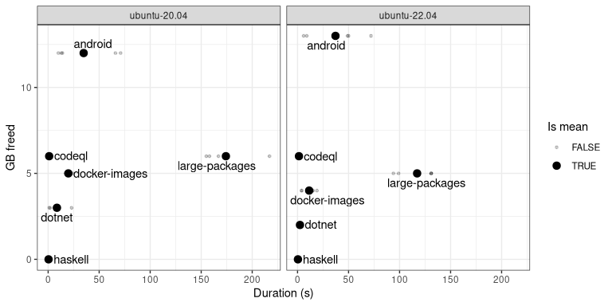

# Reclaim The Bytes

Remove unused software to reclaim disk space.

The inspiration for this action:

- [easimon/maximize-build-space](https://github.com/easimon/maximize-build-space)
- [ThewApp/free-actions](https://github.com/ThewApp/free-actions)

**Caveat:** Removal of unnecessary software is implemented by `rm -rf`
on specific folders, not by using a package manager or anything
sophisticated. While this is quick and easy, it might delete
dependencies that are required by your job and so break your build
(e.g. because your build job uses a .NET based tool and you removed the
required runtime). Please verify which software may or may not be
removed for your specific use case.

## Usage

``` yaml
name: My build action requiring more space
on: push

jobs:
  build:
    name: Build my artifact
    runs-on: ubuntu-latest
    steps:
      - name: Reclaim the bytes
        uses: data-intuitive/reclaim-the-bytes@v1

      - name: Checkout
        uses: actions/checkout@v3

      - name: Build
        run: |
          echo "Free space:"
          df -h
```

## Inputs

- `remove-dotnet`: Remove .NET runtime and libraries. Default: `true`.
- `remove-android`: Remove Android SDKs and Tools. Default: `true`.
- `remove-haskell`: Remove GHC (Haskell) artifacts. Default: `true`.
- `remove-codeql`: Remove CodeQL Action Bundles. Default: `true`.
- `remove-docker-images`: Remove cached Docker images. Default: `true`.
- `remove-large-packages`: Remove large packages. Default: `false`.

## Measurements

In deciding which software to remove, you do not only need to take into
account whether the software is needed or not, but also how long it
takes to remove vs. the amount of disk space removing it frees up. Here
is a visualisation of that information.

| Software       | OS           | Duration (s) | Space freed (GB) |
|:---------------|:-------------|-------------:|-----------------:|
| android        | ubuntu-20.04 |         34.8 |               12 |
| android        | ubuntu-22.04 |         37.2 |               13 |
| codeql         | ubuntu-20.04 |          1.0 |                6 |
| codeql         | ubuntu-22.04 |          1.4 |                6 |
| docker-images  | ubuntu-20.04 |         19.8 |                5 |
| docker-images  | ubuntu-22.04 |         11.4 |                4 |
| dotnet         | ubuntu-20.04 |          8.6 |                3 |
| dotnet         | ubuntu-22.04 |          2.4 |                2 |
| haskell        | ubuntu-20.04 |          0.4 |                0 |
| haskell        | ubuntu-22.04 |          0.4 |                0 |
| large-packages | ubuntu-20.04 |        174.2 |                6 |
| large-packages | ubuntu-22.04 |        117.2 |                5 |


